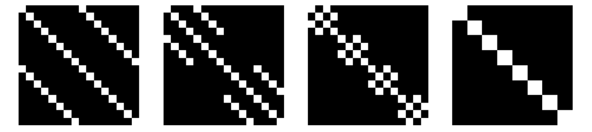
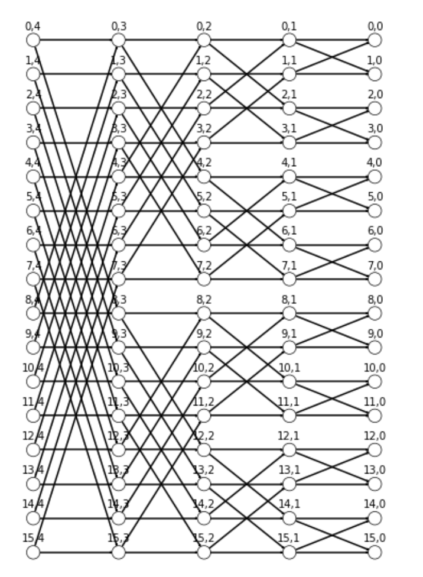

# Sparse Linear Networks with a Fixed Butterfly Structure: Theory and Practice

Code to accompany the paper **Sparse Linear Networks with a Fixed Butterfly Structure: Theory and Practice**


A 16 × 16 butterfly network represented as product of 4 sparse matrices            |  A 16 × 16 butterfly network represented as a 4-layered graph
:-------------------------:|:-------------------------:
  |  

## Requirements

- [x] python>=3.6
- [x] pytorch>=1.8
- [x] numpy
- [x] scipy

## Example Usage

Let's run the proposed replacement for a Dense Linear Layer over a simple one hidden layer Neural Network. All you need to do is to use `BF` instead of `nn.Linear` in any of your models.

```python
from butterfly import Butterfly

# Definition of BF
def BF(input_dim,output_dim,k1,k2):
    n1,n2 = input_dim, output_dim
    first_gadget = Butterfly(in_size=n1, out_size=k1)
    second_gadget = nn.Linear(k1,k2)
    third_gadget = Butterfly(in_size=k2, out_size= n2)
    
    return nn.Sequential(first_gadget,second_gadget,third_gadget)

# Proposed replacement
from torch import nn

class Network(nn.Module):
    def __init__(self):
        super().__init__()
        
        # Inputs to hidden layer (linear transformation
        k1 = 10
        k2 = 8
        self.hidden = BF(784, 256,k1,k2) # nn.Linear(784, 256)
        # Output layer, 10 units - one for each digit
        k1 = 8
        k2 = 3
        self.output = BF(256, 10,k1,k2) #nn.Linear(256, 10)
        
        # Define sigmoid activation and softmax output 
        self.sigmoid = nn.Sigmoid()
        self.softmax = nn.Softmax(dim=1)
        
    def forward(self, x):
        # Pass the input tensor through each of our operations
        x = self.hidden(x)
        x = self.sigmoid(x)
        x = self.output(x)
        x = self.softmax(x)
        
        return x
```
Done! The network now has Butterfly layers.

## <div align="center">Run Experiment Examples</div>

### To run experiments from Section 5.2 - Encoder-Decoder Butterfly network (example):

```bash
python Encoder-Decoder\ Butterfly\ Network.py --lr 0.001 --epochs 2000 --batch-size 64 --dataset 'MNIST'
```

### To run experiments from Section 5.3 - Two Phase Learning (example):

```bash
python Two-phase\ learning.py --epochs 5000 --dataset 'MNIST' --batch-size 128 --lr 0.001
```

### To run experiments from Section 5.1 - Replacing Dense Linear Layers (example):

```bash
python Replacing\ Dense.py --lr 0.001 --epochs 200 --butterfly True --model "ResNet18" --dataset "CIFAR10"
```

### To run experiments from Section 6 - Sketching for Low-Rank Matrix Decomposition (example):

```bash
python Sketching\ for\ Low-Rank\ Matrix\ Decomposition.py --experiment 1 --premute "False" --m 20 --k 10 --dataset 'CIFAR10' --epochs 250
```

Experiment ID details:

Experiment 1: Sparse trained

Experiment 2: Butterfly trained

Experiment 3: Average loss on 100 random sparse and 100 random dense

Experiment 4: Average random sparse and random dense on different combinations

Experiment 5: Random sparse on different combinations

Experiment 5: Random Butterfly on different combinations


## Citations

```BibTeX
@inproceedings{
Sparse Linear Networks,
title={Sparse Linear Networks with a Fixed Butterfly Structure: Theory and Practice},
author={Omer Leibovitch and Vineet Nair and Nir Ailon},
year={2021},
booktitle={the 37th Conference on Uncertainty in Artificial Intelligence (UAI 2021)}
}
```
